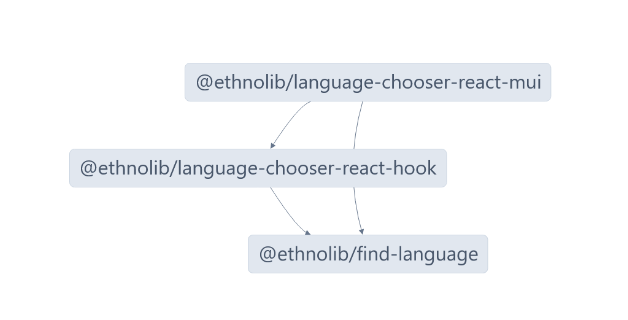

> [!warning]
> This project is currently under development and not ready for public use.

# Ethnolib

Ethnolib is a small collection of browser components for language apps. Each component may be published to its own npm package.

## Components

### [Find-Language](components/language-chooser/common/find-language/README.md)

A package for fuzzy-searching for languages, with language database based on [langtags.json](https://github.com/silnrsi/langtags). It also includes various utilities for working with language tags and language info.

### [Language Chooser React Hook](components/language-chooser/react/common/language-chooser-react-hook/README.md)

A React hook that provides the logic for a language chooser component. It utilizes the `find-language` component.

### [MUI Language Chooser](components/language-chooser/react/language-chooser-react-mui/README.md)

A MUI styled language chooser interface, initially developed for use in [BloomDesktop](https://github.com/BloomBooks/BloomDesktop). It uses the `language-chooser-react-hook` component.



## Development

Ethnolib is a [monorepo using nx](https://nx.dev/concepts/decisions/why-monorepos), with npm for package management.

We recommend installing nx globally.
`npm i -g nx`. If you prefer not to, you can simply prefix all commands with with `npx` instead.

Nx caches builds for efficiency. To clear the local cache, run `nx reset`.

Use nx to build or run a hot-reload development server for a package if relevant. For example, to build or run the MUI language chooser demo:

```
nx build @ethnolib/language-chooser-react-mui
```

or

```
nx dev @ethnolib/language-chooser-react-mui
```

### Dependency Versions

We are currently having all packages manage their own dependencies in their package level `package.json` files, but keeping them all on the same versions of commonly used packages for compatibility. Current versions:

    "react": "^17.0.2",
    "@mui/material": "^5.15.19",
    "@emotion/react": "^11.11.4",
