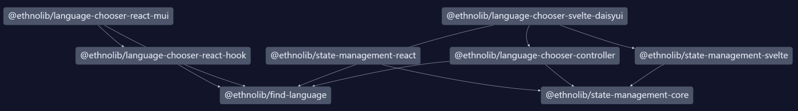
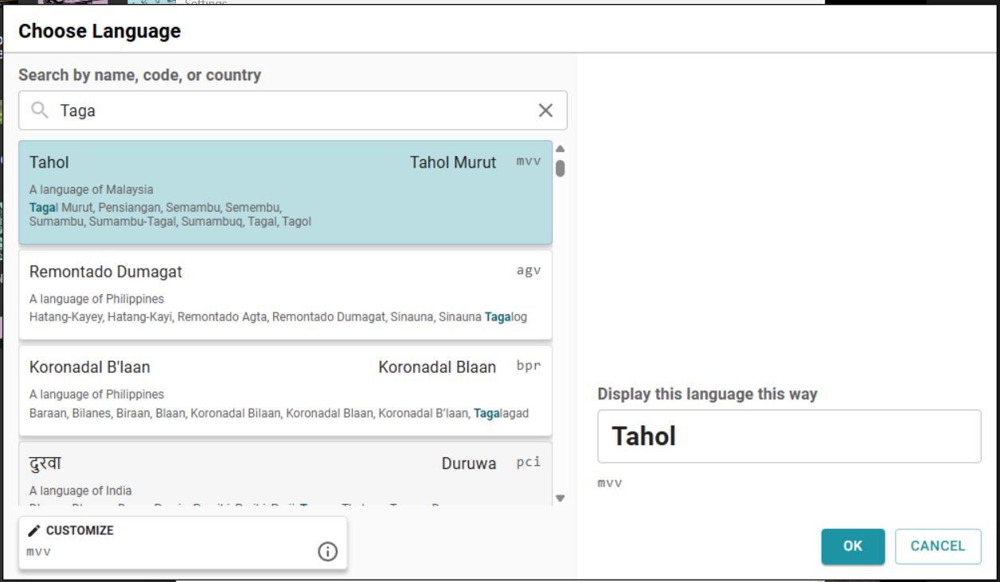

# Ethnolib

Ethnolib is a small collection of browser components for language apps. Each component may be published to its own npm package.

## Components



### Main UI Components

#### [MUI Language Chooser](components/language-chooser/react/language-chooser-react-mui/README.md)

A MUI styled language chooser interface, initially developed for use in [BloomDesktop](https://github.com/BloomBooks/BloomDesktop). It uses the `language-chooser-react-hook` component.



#### [Svelte DaisyUI Language Chooser](components/language-chooser/svelte/language-chooser-svelte-daisyui/README.md)

A DaisyUI-styled Svelte language chooser package published as `@ethnolib/language-chooser-svelte-daisyui`. It provides `LanguageChooser` and `LanguageChooserModal` components built on `find-language`, `language-chooser-controller`, and `state-management-svelte`.

### Utility components

#### [Find-Language](components/language-chooser/common/find-language/README.md)

A package for fuzzy-searching for languages, with language database based on [langtags.json](https://github.com/silnrsi/langtags). It also includes various utilities for working with language tags and language info.

#### [Language Chooser React Hook](components/language-chooser/react/common/language-chooser-react-hook/README.md)

A React hook that provides the logic for a language chooser component. It utilizes the `find-language` component.

#### [State Management Core](components/state-management/state-management-core/README.md)

A framework-agnostic view model package centered on `Field` objects. It provides the shared reactive state model used by the framework adapters in this repo.

#### [State Management React](components/state-management/state-management-react/README.md)

A React adapter published as `@ethnolib/state-management-react`. It lets React components subscribe to `Field` instances with the `useField()` hook.

#### [State Management Svelte](components/state-management/state-management-svelte/README.md)

A Svelte adapter published as `@ethnolib/state-management-svelte`. It wraps view models with `svelteViewModel()` so `Field` instances can be used as ordinary reactive Svelte properties.

## Development

Ethnolib is a [monorepo using nx](https://nx.dev/concepts/decisions/why-monorepos), with npm for package management.

We recommend installing nx globally.
`npm i -g nx`. If you prefer not to, you can simply prefix all commands with with `npx` instead.

Nx caches builds for efficiency. To clear the local cache, run `nx reset`.

Use nx to run a hot-reload development server for a package if relevant. For example, to run one of the language chooser demos:

```
nx dev @ethnolib/language-chooser-react-mui
```

or

```
nx dev @ethnolib/language-chooser-svelte-daisyui
```

### Composed Storybook

The language chooser demos are also available as a composed Storybook that shows both the React MUI stories and the Svelte DaisyUI stories.

For local development, run:

```
npm run storybook:language-chooser:all
```

This starts the Svelte Storybook on port `6007`, waits for it to be ready, and then starts the React Storybook shell on port `6006`.

For GitHub Pages deployment, the React Storybook is built as the root site and the Svelte Storybook is built into its nested `storybook-static/svelte` folder. The Pages workflow uploads the entire React `storybook-static` directory, so the nested Svelte files are deployed along with it.

### Dependency Versions

We are currently having all packages manage their own dependencies in their package level `package.json` files, but keeping them all on the same versions of commonly used packages for compatibility. Current versions:

    - "react": "^17.0.2"
    - "@mui/material": "^5.15.19"
    - "@emotion/react": "^11.11.4"

    - "svelte": "^5.38.6"

For volta users, we specify the node version in the main package.json, and then all packages should inherit it by adding something like the following to their package.json, with the path relative path to the main package.json. See https://docs.volta.sh/advanced/workspaces

    "volta": {
        "extends": "../../../../package.json"
    }

## Testing

Vitest is used for writing unit tests. From the top level folder, all of the unit tests can be run with these commands:

```
npm run test{once}
```

The first command runs the tests continually in _watch_ mode with minimal output while tests are passing successfully. The second command runs all the tests just once and quits after printing a summary of test results to the console window.

### End-to-end

End-to-end tests can be run with:

```
npm run e2e
```

## Commit Messages

This repo uses Conventional Commit-style prefixes (enforced by commit-hook), which inform Nx's automatic versioning in our Github Actions release pipeline.

Accepted prefixes are:

- `feat:` to trigger a minor version bump
- `fix:` to trigger a patch version bump
- `chore:` for a commit that doesn't trigger a release/version bump

Examples:

- `feat: add language search sorting`
- `fix(find-language): handle zh-CN fallback`
- `chore(repo): update dev tooling`
- `feat(api)!: remove legacy endpoint`
